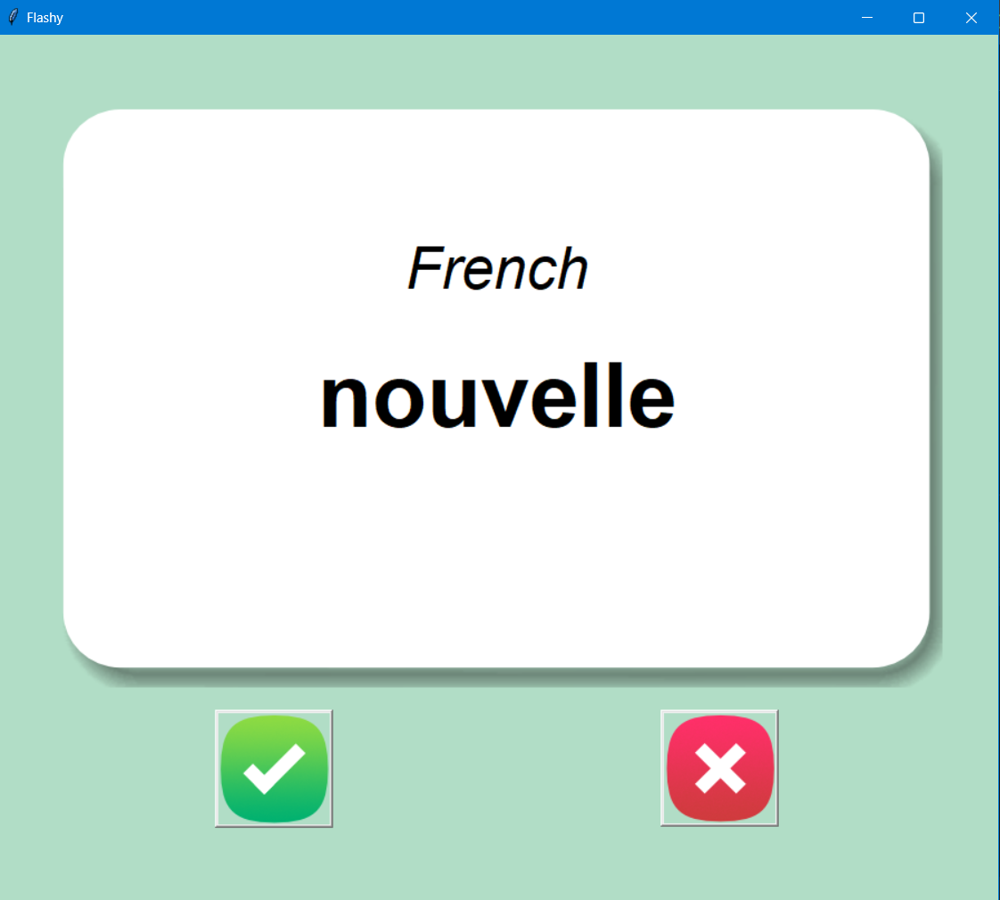

# Flashy

Flashy is a simple flashcard application built with Python's Tkinter and Pandas libraries. It helps users learn French words by displaying them on flashcards and allowing users to test their knowledge.

## Features

- **Flashcards:** Display French words on the front of the flashcard and their English translations on the back.
- **Interactive Buttons:** Use interactive buttons to test your knowledge of French words. Click the "Right" button if you know the translation, or the "Wrong" button if you need more practice.
- **Dynamic Learning:** The flashcards are dynamically loaded from a CSV file (`data/french_words.csv`), providing an easy way to update and expand the list of words.

## Usage

1. Clone the repository to your local machine.
2. Ensure you have the necessary dependencies installed (`tkinter` and `pandas`).
3. Run the script using `python your_script_name.py`.

## Flashcard Interactions

- **Right Button:** Click to mark the word as correct. The word will be removed from the flashcard list, helping you focus on the words you need to practice.
- **Wrong Button:** Click to reveal the English translation and continue practicing.

## Customization

- **CSV File:** You can customize the list of French words by modifying the `data/french_words.csv` file. Add or remove rows to personalize your learning experience.

## Dependencies

- Python 3.x
- Tkinter
- Pandas

## Screenshots

## Acknowledgments

- Flashcard images provided by [example.com](https://example.com).
- French words dataset inspired by [french-words-dataset](https://github.com/ayoubfakir/french-words-dataset).

## Author

[Your Name]

## License

This project is licensed under the MIT License - see the [LICENSE.md](LICENSE.md) file for details.
